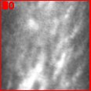
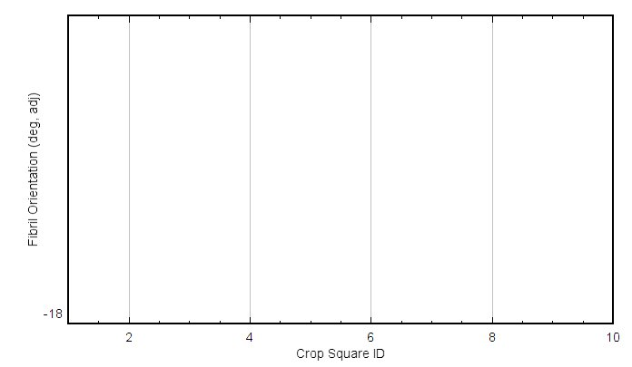
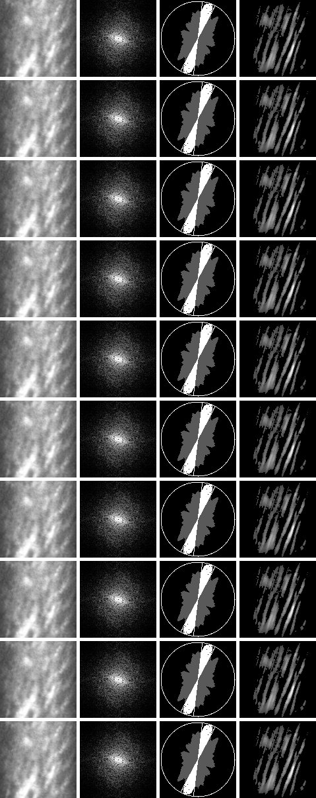
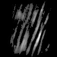
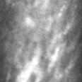
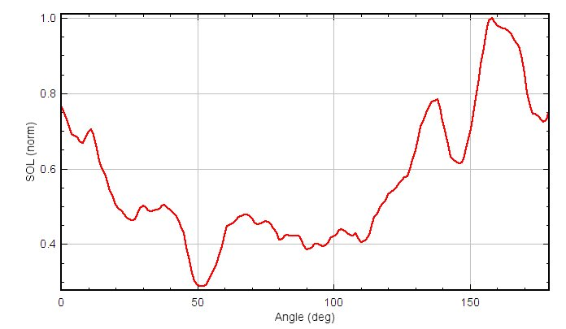
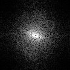
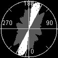

This document mirrors the Fiji/ImageJ plugin **FIBA Tile Montage (MATLAB)** pipeline.
It’s intended for troubleshooting and clarity: the math is written out, and code blocks
are provided to load and visualize the plugin outputs.

## Pipeline overview

For each tile (square crop), the Java pipeline does:

1. Contrast stretch (MATLAB `imadjust`-like).
2. Apply a separable 2D Tukey window (edge blending).
3. Compute 2D FFT, take magnitude, then `fftshift`.
4. Build an orientation signal $\mathrm{SOL}(\theta)$ by sampling in polar coordinates and summing along radius.
5. Find a statistically significant peak band and estimate fiber angle.
6. Build a band-limited frequency mask (radial Tukey $\times$ angular Tukey), inverse FFT reconstruct, threshold.

Outputs (typical): montage, per-tile panels (`*_crop.jpg`, `*_fft.jpg`, `*_fft.tif`, `*_polar.jpg`, `*_rec.jpg`, `*_mask.jpg`), SOL plots, CSV.

## Key equations and concepts

### Tukey window (MATLAB `tukeywin`)

Let $n$ be the window length and $\alpha \in [0,1]$. Define $t = \frac{i}{n-1}$ for $i=0,\dots,n-1$.

$$
 w(t)=\begin{cases}
 \tfrac12\left(1+\cos\left(\pi\left(\tfrac{2t}{\alpha}-1\right)\right)\right), & 0\le t < \tfrac{\alpha}{2}\\
 1, & \tfrac{\alpha}{2} \le t \le 1-\tfrac{\alpha}{2}\\
 \tfrac12\left(1+\cos\left(\pi\left(\tfrac{2t}{\alpha}-\tfrac{2}{\alpha}+1\right)\right)\right), & 1-\tfrac{\alpha}{2} < t \le 1
 \end{cases}
$$

Limiting behaviors: $\alpha=0$ gives a rectangular window and $\alpha=1$ gives a Hann window.

The plugin applies this separably as a 2D window $W[x,y] = w_x w_y$, then windows the image around its mean:

$$
S[x,y] = W[x,y]\,(J[x,y]-\bar{J}) + \bar{J}.
$$

### Discrete Fourier Transform (DFT) and the FFT

For an $n\times n$ image $S[x,y]$ (after normalization + windowing), the 2D DFT is

$$
K[u,v] = \sum_{x=0}^{n-1} \sum_{y=0}^{n-1} S[x,y]\,\exp\left(-j2\pi\left(\frac{ux}{n} + \frac{vy}{n}\right)\right)
$$

for indices $u,v \in \{0,\dots,n-1\}$.

The **FFT** (Fast Fourier Transform) is an *algorithm* that computes these same DFT values exactly, but faster:

- 1D: from $O(N^2)$ to $O(N\log N)$
- 2D ($n\times n$): typically $O(n^2\log n)$ via separable 1D FFTs along rows and columns

In modeling terms, the DFT/FFT is a discrete transform on samples; it only “approximates” a continuous Fourier transform to the extent that $S[x,y]$ is treated as samples of an underlying continuous image.

### Power spectrum (where it is used)

The **power spectrum** is

$$
P(u,v) = |K(u,v)|^2.
$$

In the plugin, the *display* image for the spectrum is based on a log-power transform

$$
D(u,v) = \log\bigl(1 + P(u,v)\bigr)
$$

followed by a robust (percentile) contrast stretch so the DC spike does not dominate.

### Orientation signal (SOL)

After computing $|K|$ and applying `fftshift` so DC is centered, the pipeline builds an angle-dependent signal by polar sampling.
With center at $(w,w)$ where $w=n/2$ and $\theta$ measured from the **vertical axis** (row direction):

$$
B(\theta)=\sum_{r=r_{\min}}^{r_{\max}} |K|\bigl(w + r\cos\theta,\; w + r\sin\theta\bigr)
$$

using bilinear interpolation at non-integer coordinates.
$B$ is then mapped into 180 bins and normalized to form $\mathrm{SOL}(\theta)$ with $\sum_{\theta} \mathrm{SOL}(\theta)=1$.

## Viewing plugin outputs

The Java plugin typically writes outputs into your Downloads folder unless overridden by an `outputDir=...` option.

```python
from __future__ import annotations

from pathlib import Path

import numpy as np
from PIL import Image
import matplotlib.pyplot as plt

plt.rcParams['figure.figsize'] = (6, 6)
plt.rcParams['image.cmap'] = 'gray'
print('OK')
```

```python
# Configure where Fiji/Java outputs are located

downloads = Path.home() / 'Downloads'
out_dir = downloads

# Base name used by FIBA_Tile_Montage = stripExtension(imp.getTitle())
# For an image opened as .../C15D5P001_tiles/4.jpg, baseName is typically '4'.
base = '4'

print('Output dir:', out_dir)
print('Exists:', out_dir.exists())
```

```python
# List the newest output files for this base name
files = sorted(out_dir.glob(f'{base}_tile*'), key=lambda p: p.stat().st_mtime, reverse=True)
for p in files[:30]:
    print(p.name)
print('Total matching files:', len(files))
```

```python
# Show montage and orientation-vs-tile profile

montage_path = out_dir / f'{base}_tile_montage.jpg'
profile_path = out_dir / f'{base}_tile_profile.jpg'

for title, path in [('montage', montage_path), ('profile', profile_path)]:
    if path.exists():
        img = Image.open(path)
        plt.figure(figsize=(10, 8))
        plt.imshow(img)
        plt.axis('off')
        plt.title(f'{title}: {path.name}')
        plt.show()
    else:
        print('Missing:', path)
```

## Diagnosing FFT display artifacts (JPEG vs lossless TIFF)

If the plugin saved `*_fft.tif` (32-bit float), it helps distinguish FFT artifacts from JPEG/8-bit display artifacts.

```python
# Inspect one tile's outputs

tile_id = 4
paths = {
    'crop': out_dir / f'{base}_tile{tile_id}_crop.jpg',
    'fft_jpg': out_dir / f'{base}_tile{tile_id}_fft.jpg',
    'fft_tif': out_dir / f'{base}_tile{tile_id}_fft.tif',
    'polar': out_dir / f'{base}_tile{tile_id}_polar.jpg',
    'rec': out_dir / f'{base}_tile{tile_id}_rec.jpg',
    'mask': out_dir / f'{base}_tile{tile_id}_mask.jpg',
}

for k, p in paths.items():
    print(k, '->', p.exists(), p.name)

fig, axes = plt.subplots(2, 3, figsize=(12, 8))
axes = axes.ravel()
keys = ['crop', 'fft_jpg', 'polar', 'mask', 'rec']
for ax, k in zip(axes, keys):
    p = paths[k]
    if not p.exists():
        ax.set_title(f'missing: {k}')
        ax.axis('off')
        continue
    ax.imshow(Image.open(p))
    ax.set_title(k)
    ax.axis('off')
axes[-1].axis('off')
plt.tight_layout()
plt.show()
```

```python
def read_grayscale_u8(path: Path) -> np.ndarray:
    img = Image.open(path).convert('L')
    return np.asarray(img, dtype=np.float32) / 255.0

fft_jpg = paths['fft_jpg']
jpg = read_grayscale_u8(fft_jpg)
h, w = jpg.shape
cc = jpg[:, w // 2]
print('FFT JPG shape:', jpg.shape)
print('center-col zeros:', int(np.sum(cc == 0.0)), 'of', cc.size)

plt.figure(figsize=(10, 3))
plt.plot(cc)
plt.title('Center column profile (FFT JPG)')
plt.ylim(-0.02, 1.02)
plt.grid(True, alpha=0.3)
plt.show()
```

```python
# Optional: read the float TIFF if tifffile is available.
fft_tif = paths['fft_tif']
if not fft_tif.exists():
    print('No TIFF found:', fft_tif)
else:
    try:
        import tifffile as tiff
        tif = tiff.imread(str(fft_tif)).astype(np.float32)
        cc_t = tif[:, tif.shape[1] // 2]
        print('FFT TIF shape:', tif.shape)
        print('center-col exact zeros (float):', int(np.sum(cc_t == 0.0)), 'of', cc_t.size)

        # visualize robustly
        lo, hi = np.quantile(tif, [0.01, 0.999])
        tif_vis = np.clip((tif - lo) / (hi - lo + 1e-12), 0, 1)
        plt.figure(figsize=(6, 6))
        plt.imshow(tif_vis)
        plt.axis('off')
        plt.title('FFT TIFF (visualized)')
        plt.show()

        plt.figure(figsize=(10, 3))
        plt.plot(cc_t)
        plt.title('Center column profile (FFT TIFF, raw float)')
        plt.grid(True, alpha=0.3)
        plt.show()
    except Exception as e:
        print('Could not read TIFF (install tifffile?):', e)
```

## Notes on execution

- This document is set up to render even if you **don’t** have a Python/Jupyter environment available.
- When you want Quarto to actually run the code blocks, flip `execute.eval` to `true` in the document header (or in `_quarto.yml`) and ensure Python + required packages are installed.
- If you prefer a Java kernel instead of Python, Quarto can run through a Jupyter Java kernel (IJava/BeakerX), but that requires installing Jupyter + the kernel.

## Embedded images (in-repo assets)

You asked for **actual images inside the markdown/HTML**.
To make the rendered HTML self-contained (and not dependent on `C:\Users\...\Downloads`), I copied the plugin outputs for base `4` into the repo at:

- `notebooks/_assets/fiba_tile_montage/4/`

Everything below is referenced with **relative paths**, so Quarto will render the images inline.

### Final outputs

{fig-alt="Tile boxes overlay" width=80%}

{fig-alt="Orientation vs tile" width=90%}

{fig-alt="Tile montage" width=100%}

### In-between panels (example tiles)

These are the visuals that explain what the plugin is doing per tile.

#### Tile 1

| crop | FFT | polar |
|---|---|---|
| {width=30%} | {width=30%} | {width=30%} |

| SOL plot | mask | reconstruction |
|---|---|---|
| {width=30%} | {width=30%} | {width=30%} |

#### Tile 2

| crop | FFT | polar |
|---|---|---|
| {width=30%} | {width=30%} | {width=30%} |

| SOL plot | mask | reconstruction |
|---|---|---|
| {width=30%} | {width=30%} | {width=30%} |

#### Tile 3

| crop | FFT | polar |
|---|---|---|
| {width=30%} | {width=30%} | {width=30%} |

| SOL plot | mask | reconstruction |
|---|---|---|
| {width=30%} | {width=30%} | {width=30%} |

#### Tile 4

| crop | FFT | polar |
|---|---|---|
| {width=30%} | {width=30%} | {width=30%} |

| SOL plot | mask | reconstruction |
|---|---|---|
| {width=30%} | {width=30%} | {width=30%} |
